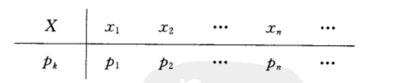
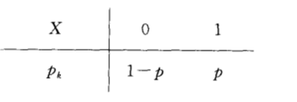

# 第二章 随机变量及其分布

## 2.1 随机变量的概念

### 定义

设随机试验的样本空间为 $S={e}$，则$X=X(e)$是定义在样本空间$S$上的实值单值函数，称==$X=X(e)$==为*随机变量*，称$\{e \mid X(e)=a\}$为*事件*

## 2.2 离散型随机变量及其分布律

### 定义

可能取到的值是*有限个*或*可列无限多个*的随机变量称为**离散型随机变量**

设离散型随机变量 $X$ 所有可能的取值为 $x_k(k=1,2,...)$，则事件 $\{X=x_k\}$ 的概率为 

$$
P\{X=x_k\}=p_k,k=1,2...
$$
由概率的定义，pk 满足如下两个条件

1. $p_{k} \geqslant 0, k=1,2, \cdots ;$
2. $\sum_{k=1}^{\infty} p_{k}=1$

分布律也可以用表格的方式来表示

 

### 常见的分布

#### （0 - 1）分布

即 
$$
P\{X=k\}=p^k(1-p)^{1-k},k=0,1
$$

	

#### 二项分布（伯努利试验） $X\sim b(n,p)$

就是将 0 - 1 分布重复 n 次

$$
P\{X=k\}=\left(\begin{array}{l}n \\ k\end{array}\right) p^{k}q^{n-k}
$$
因为 $\left(\begin{array}{l}n \\ k\end{array}\right) p^{k}(1-p)^{n-k}$ 刚好是二项式 $(p+q)^n$ 的展开式中出现 pk 的那一项，我们称随机变量 X 服从参数为 n，p 的**二项分布**，并记为 ==$X\sim b(n,p)$== ，特别，当 n = 1 时，二项分布 (2) 化为 $p^{k}q^{n-k},k=0,1$，即（0 - 1）分布

#### 泊松分布 $ X \sim \pi(\lambda)$

$$
P\{x=k\}=\frac{\lambda^{k}}{k !} e^{-\lambda} \quad k=0,1,2,3, \cdots,\lambda>0
$$

常见于电台呼叫次数、公共设施（等车、收银台、挂号处）等题目

一般查表解决

#### 几何分布 $X\sim G(p)$

第 K 次**首次**发生，即前面 k - 1 次未发生

$$
P\{X=k\}=(1-p)^{k-1}p
$$
#### 超几何分布 $X\sim H(N,M,n)$

产品抽样检查中经常遇到一类实际问题，假定在N件产品中有M件不合格品，即不合格率 $p=\frac{M}{N}$，在产品中随机抽n件做检查，发现k件不合格品的概率为
$$
P(X=k)=\frac{C^k_MC^{n-k}_{N-M}}{C^n_N}
$$

## 2.3 连续型随机变量及其概率密度函数

### 定义

非负可积函数 f(x)，$f(x)\ge 0,a<b$，则
$$
p\{a<X \leq b\}=\int_{a}^{b} f(x) d x
$$

X 为连续型随机变量，f(X) 为概率分布密度函数，记作$X~f(x)$

### 性质

1. $f(x)\ge 0$

2. $\int_a^b f(x)=1$

3. 连续型随机变量，取*个别值的概率*为 0

4. 连续型随机变量左右端点取不取得到无所谓，即
   $$
   P\{a\le x\le b\}=P\{a< x\le b\}=P\{a\le x< b\}=P\{a< x< b\}\\
   P\{x<a\}=P\{x\le a\}\\
   P\{x>a\}=P\{x\ge a\}
   $$
   
5. 概率为 0 的事件未必是不可能事件，概率为 1 的事件未必是必然事件

6. $f\{x<x<x+\Delta x\} \approx f(x) \Delta x$ 

### 例题

$f(x)=\left\{\begin{array}{cc}
k x + 1 & 0 \leqslant x \leqslant 2 \\
0 . & 其他
\end{array}\right.$，求 $k$ , $P\{X\le2\}$ 和 $P\{1.5<X<2.5\}$

解：$\int_{-\infty}^{+\infty} f(x) d x=\int_{0}^{2}(k x+1) d x=1,则k=-\frac{1}{2}$

​       $P\{X\le2\}=P\{-\infty<X\le2\}=\int_{-\infty}^2f(x)dx=\int^2_0(-\frac{1}{2}x+1)dx=1$

​       $P\{1.5<X<2.5\}=\int^2_{1.5}(-\frac{1}{2}x+1)dx=0.0625$

### 常见的分布

#### 均匀分布 $X \sim U[a, b]$

$$
f(x)=\left\{\begin{array}{cc}\frac{1}{b-a} & a \leqslant x \leqslant b . \\ 0 & \text { else }\end{array} \right.
$$

可以发现，均匀分布的概率就是定义域区间**长度的倒数**

#### 指数分布$X\sim E(\lambda)$

概率密度函数：
$$
f(x)=\left\{\begin{array}{ll}
\lambda e^{-\lambda x} & x>0 \\
0 & x \leq 0
\end{array}\right.
$$

其中λ > 0是分布的一个参数，常被称为率参数（rate parameter）。即每单位时间内发生某事件的次数。指数分布的区间是[0,∞)。

分布函数:
$$
F(x , \lambda)=\left\{\begin{array}{cl}
1-e^{-\lambda x} & , x \geq 0, \\
0 & , x<0 .
\end{array}\right.
$$

#### 正态分布$X\sim N(\mu,\sigma^2)$

概率密度函数：
$$
f(x)=\frac{1}{\sqrt{2 \pi} \sigma} e^{-\frac{(x-\mu)^{2}}{2 \sigma^{2}}},-\infty<x<\infty
$$
分布函数：
$$
F(x)=\frac{1}{\sqrt{2 \pi} \sigma} \int_{-\infty}^{x} e^{-\frac{(t-\mu)^{2}}{2 \sigma^{2}}} d t
$$
性质：

1. $y=f(x)$ 以 $x=\mu$ 为对称轴，当 $x=\mu$ 时，$f(x)$ 取最大值 $\frac{1}{\sqrt{2\pi}\sigma}$ 

2. $y=f(x)$ 以 x 轴为渐近线

3. 若 $\sigma$ 固定，$\mu$ 变化，则图像左右移动

   若 $\mu$ 固定，$\sigma$ 变化，则图像最高点移动

#### 标准正态分布$X\sim N(0,1)$

即 $\mu=0,\sigma=1$

概率密度函数：

$$
f(x)=\frac{1}{\sqrt{2\pi}}e^{-\frac{x^2}{2}},-\infty<x<\infty
$$

分布函数：
$$
F(x)=\frac{1}{\sqrt{2\pi}}\int^x_\infty e^{-\frac{t^2}{2}}dt
$$
性质：

1. 以 y 轴为对称轴，为偶函数

2. $F(-x)=1-F(x)$

#### 正态分布和标准正太分布的转换

记正态分布为 $f$，标准正态分布为 $f_0$

$f(x)=\frac{1}{\sigma}f_0(\frac{x-\mu}{\sigma})$

$F(x)=F_0(\frac{x-\mu}{\sigma})$ 

## 2.4 随机变量的分布函数

### 基本概念

#### 定义

分布函数：
==$F(x)=P(X\le x)$==
即 X 取值不超过 x 时的概率

分布函数是个普通的实函数，$x \in(-\infty,+\infty) \quad F(x) \in[0,1]$

对离散型和连续型随机变量都成立

#### 性质

1. $0\le F(x)\le 1,x \in(-\infty,+\infty)$
2. F(x) 是个不减函数，任给 $x_1<x_2$，有$F(x_1)\le F(x_2)$，因为$P(x_1)\le P(x_2)$（$P(x_1)包含于P(x_2))$
3. $\lim _{x \rightarrow+\infty} F(x)=F(+\infty)=1$；$\lim _{x \rightarrow-\infty} F(x)=F(-\infty)=0$
4. F(x) 是右连续的（*离散型*的是右连续的，*连续型*的是连续的）

#### 常见的算式

$$
\begin{array}{l}
F(x)=P(x \leq x) \\
P\{x \leq a\}=F(a) \\
P\{x>a\}=1-P\{x \leq a\}=1-F(a) \\
P\{a<x \leq b\}=p\{x \leqslant b\}-p\{x \leqslant a\}=F(b)-F(a) \\
P\{x=a\}=F(a)-F(a-0) \\
P\{a \leqslant x \leqslant b\}=F(b)-F(a-0) \\
P\{x<a\}=F(a-0) 此时的x是从左边逼近a，但是不包含F(a)\\
P\{x>\alpha\}=1-F(a-0)
\end{array}
$$

### 离散型的分布函数

 #### 例题1：由概率函数求分布函数

最后列出标准的方程
$$
F(x)=\left\{\begin{array}{cc}
0 & x < 2 \\
... & ...
\end{array}\right.
$$
其分段的取值范围为`[  )`形，因为离散型分布函数是**右连续**的

#### 例题2：由分布函数求概率函数

1. 取值范围的间断点就是 X 的取值
2. $P\{X=x_p\}=F(x_k)-F(x_k-x_{k-1})$，$x_k$ 为间断点

### 连续型的分布函数

#### 公式

1. $F(x)=P\{X\le x\}=\int^x_{-\infty}f(t)dt$ 
2. $F^{\prime}(x)=f(x)$
#### 例题1：由概率函数求分布函数 
解题步骤和离散型的分布函数一样，列出取值范围，用 公式1 分步求积分即可

#### 例题2：由分布函数求概率函数

 

## 2.5 随机变量的函数的分布

### 基本概念

与 2.4 节不同的是，这节讲的是以随机变量为 X 的 Y 函数的分布，即 Y = f(x) 的分布

### 离散型

 

### 连续型

#### 基本方法

1. 将 Y 的分布函数，表达成 X 的分布函数，即 $F_Y(x)\rightarrow F_X(x)$ 

2. 对 1 的式子两边求导，得到 $f_Y(x)\leftarrow f_X(x)$

   则 $F_X(x)=P\{X\le x\}$

   ​    $F_Y(x)=P\{Y\le x\}$ 

#### 例题 1

$已知Y=3X+2,求Y的密度函数$

 