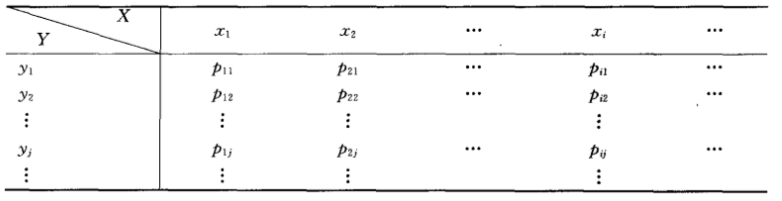
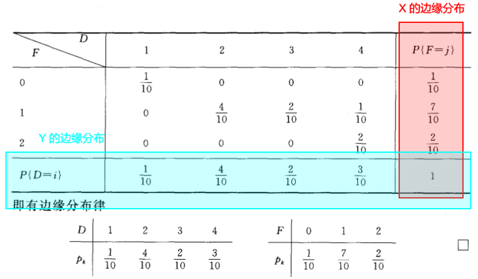

# 第三章 多维随机变量及其分布

## 3.1.1 二维随机变量及其分布函数

### 定义

#### 二维随机变量

一般，设 E 是一个随机试验，它的样本空间是 $S=\{e\}$，设 $X=X(e)$ 和 $Y=Y(e)$ 是定义在 S 上的随机变量，由它们构成了的一个向量（X，Y），叫做二位随机向量或者**二维随机变量**

#### 二维随机变量的分布函数

设（X，Y）是二维随机变量，对于任意实数 x，y，二元函数：
$$
F(x,y)=P\{(X\le x)\cap(Y\le y)\}\underline{\text { 记成 }} P\{X \leqslant x, Y \leqslant y\}
$$

称为二维随机变量（X，Y）的**分布函数**，或者称为随机变量 X 和 Y 的**联合分布函数**

### 分布函数的性质

1. $0\le F(x,y)\le 1$

2. $F(x,y)$ 不减

3. $F(-\infty,y)=0$，$F(x,-\infty)=0$，$F(-\infty,-\infty)=0$，$F(\infty,\infty)=1$

4. $F(x,y)$ 分别关于 x 和 y 右连续

5. 若 $x_1<x_2,y_1<y_2$，则 $P\{x_1<X\le x_2,y<Y\le y_2\}=F(x_2,y_2)-F(x_2,y_1)-F(x_1,y_2)+F(x_1,y_1)$ 

6. x，y 的**边缘分布**：

   $F_{X}(x)=P\{X \leq x\}=F(x,+\infty)=P\{X \le x,Y<+\infty\}$
   $F_{Y}(y)=P\{Y \leqslant y\}=F(+\infty, y)=P\{x<+\infty, Y \leqslant y\}$

## 3.2.2 二维离散型变量的联合分布和边缘分布

### 联合分布

#### 基本概念

联合分布律：

$P\{X=x_i,Y=y_j\}=P_{ij},i,j=1,2,...$ 

联合分布表：

#### 性质

1. $P_{ij}\ge 0$
2. $\sum_{i} \sum_{j} P_{i j}=1$

### 边缘分布
#### 基本概念
$F_{X}(x)=P\{X \leq x\}=F(x,+\infty)=P\{X \le x,Y<+\infty\}$
$F_{Y}(y)=P\{Y \leqslant y\}=F(+\infty, y)=P\{x<+\infty, Y \leqslant y\}$

#### 分布律

由上图易知：

- 联合分布可确定边缘分布
- 边缘分布不能确定联合分布

## 3.2.3 二维连续型变量的联合分布和边缘分布

### 联合分布

$F(x,y)=P\{X\le x,Y\le y\}=\int^x_{-\infty}\int^y_{-\infty}f(s,t)dsdt$

性质：

1. $f(x,y)\ge0$
2. $\int^{+\infty}_{-\infty}\int^{+\infty}_{-\infty}f(x,y)dxdy=1$
3. $\frac{\partial^{2} F(x, y)}{\partial x \partial y}=f(x, y)$
4. G 是 X,Y 平面上的一个区域，则 $P\{(X,Y)\in G\}=\iint_{G}f(x , y) d x d y$

### 边缘分布

$F_{X}(x)=P\{X \leq x\}=F(x,+\infty)=P\{X \le x,Y<+\infty\}=lim_{y\rightarrow+\infty}F(x,y)$
$F_{Y}(y)=P\{Y \le y\}=F(+\infty, y)=P\{x<+\infty, Y \le y\}=lim_{x\rightarrow+\infty}F(x,y)$

### 均匀分布

$f(x, y)=\left\{\begin{array}{c}\frac{1}{S(G)},(x, y) \in G . \\ 0, \text { else }\end{array}\right.$

即，密度函数为*区域面积的倒数*（一维的均匀分布为长度的倒数）

## 3.1.4 二维连续型随机变量的边缘密度函数

边缘分布函数：

$F_{X}(x)=F(x,+\infty)=\int_{-\infty}^{x}\left[\int_{-\infty}^{+\infty} f(s, t) d t\right] d s$

$F_{Y}(y)=F(y,+\infty)=\int_{-\infty}^{y}\left[\int_{-\infty}^{+\infty} f(s, t) d s\right] d t$

由边缘分布函数求导，可得**边缘密度函数**：

$f_X(x)=\int^{+\infty}_{-\infty}f(x,t)dt=\int^{+\infty}_{-\infty}f(x,y)dy$

$f_Y(x)=\int^{+\infty}_{-\infty}f(s,y)dt=\int^{+\infty}_{-\infty}f(x,y)dx$

## 3.2.1 条件分布

$$
F(x|A)=P\{X\le x|A\}=\frac{P\{X\le x,A\}}{P\{A\}}
$$

即，X 在 A 条件下的概率分布

## 3.2.2 离散型随机变量的条件分布

$$
P\{X=x_i|Y=y_j\}=\frac{p_{ij}}{p^{(2)}_{j}}
$$

| X\Y         | 0    | 1    | $P^{(1)}_i$ |
| ----------- | ---- | ---- | ----------- |
| 0           | a    | b    | a+b         |
| 1           | c    | d    | c+d         |
| $P^{(2)}_j$ | a+c  | b+d  | 1           |

则:

$P\{X=0|Y=0\}=\frac{a}{a+c}$

$P\{X=1|Y=0\}=\frac{c}{a+c}$

$P\{Y=0|X=0\}=\frac{a}{a+b}$

$P\{Y=1|X=0\}=\frac{b}{a+b}$

以此类推

## 3.2.3 连续型随机变量的条件分布

### 定义

X，Y 为二维随机变量，已知密度函数 $f(x,y)$，边缘密度函数 $f_X(x),f_Y(y)$，若 $f_Y(y)\gt0$，在 $Y=y$ 的条件下：
$$
F(X|Y)=\int^x_{-\infty}\frac{f(u,y)}{f_Y(y)}du\\
f(x|y)=\frac{f(x,y)}{f_Y(y)}
$$

## 3.2.4 随机变量的独立性

### 定义

$$
f(x|y)=f_X(x)
$$

又因为：
$$
f(x|y)=\frac{f(x,y)}{f_Y(y)}
$$
可得**定义**：
$$
f(x,y)=f_X(x)\cdot f_Y(y)\\
F(x,y)=F_X(x)\cdot F_Y(y)\\
P\{X\in S_x,Y\in S_y\}=P\{X\in S_x\}\cdot P\{Y\in S_y\}
$$

### 判断二维离散型的独立性

$$
P\{X=x_i,Y=y_j\}=P\{X=x_i\}\cdot P\{Y=y_j\}
$$

例：

### 判断二维连续型的独立性

$$
f(x,y)=f_X(x)\cdot f_Y(y)
$$

### 定理

若 X，Y 独立，则 $g_1(x),g_2(Y)$ 是独立的， $X^2,Y^2$ 独立，$a_1X+b_1,a_2X+b_2$ 独立

## 3.3.1 二维离散型随机变量函数的分布

同一维离散型随机变量的分布

## 3.3.2 二维连续型随机变量函数的分布

X，Y 相互独立，已知 $f(x,y)$，$Z=g(X,Y)$

- $F_Z(z)=P\{Z\le z\}=P\{g(X,Y)\le z\}=\iint_{D_z}f(x,y)dxdy$
- $D_z=\{(x,y)|g(x,y)\le z\}$

##