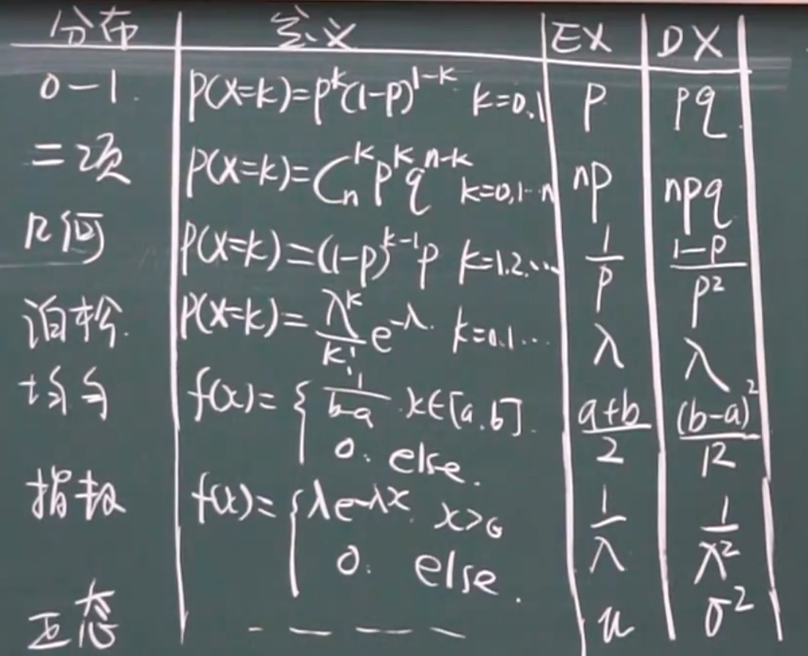

# 随机变量的数字特征

## 4.1.1 离散型变量的数学期望

存在 $P(X=x_k)=P_k$，若 $\Sigma^\infty_{k=1}x_kP_k$ *绝对收敛*，则
$$
EX=\Sigma^\infty_{k=1}x_kP_k
$$
即所有情况下概率×取值之和

## 4.1.2 连续型变量的数学期望

存在随机变量 X，其密度函数为 $f(x)$，假设 $ \int^{+\infty}_{-\infty}xf(x)dx$ 绝对收敛，那么
$$
EX=\int^{+\infty}_{-\infty}xf(x)dx
$$

## 4.1.3 随机变量的函数的数学期望

### 一维的

存在随机变量 $Y=g(X)$，已知 $EX=\sum^\infty_{k=1}x_kP_k$，则

#### 离散型的

$$
EY=\Sigma^\infty_{k=1}g(x)_kP_k
$$

#### 连续型的

$$
EY=\int^{+\infty}_{-\infty}g(x)f(x)dx
$$

### 二维的

$$
Z=g(X,Y)
$$

#### 离散的

$$
EZ=\sum_{i} \sum_{j} g\left(x_{i} , y_{j}\right) p_{i j}$
$$

#### 连续的
$$
EZ=\int^{+\infty}_{-\infty}\int^{+\infty}_{-\infty}g(x,y)f(x,y)dxdy
$$

## 4.1.4 数学期望的性质

1. 常数的期望等于常数：$EC=C$

2. $E(X+C)=EX+C$

3. $E(CX)=C\cdot EX$

4. $E(kX+b)=k\cdot EX+b$

5. $E(X\pm Y)=EX\pm EY$

   $E(\Sigma C_iX_i)=\Sigma C_i\cdot EX_i$（推论）

   $E(\frac1n\Sigma X_i)=\frac1n\Sigma EX_i$（推论）
6. 当 X，Y 独立时，$E(XY)=EX\cdot EY$

## 4.1.5 条件期望

### 离散型

$$
E(X|Y=y_j)=\sum x_iP(X=x_i|Y=y_j)\\
E(Y|X=X_i)=\sum y_jP(Y=Y_j|X=x_i)
$$

即用 $x_i$ 的取值 × 条件概率

### 连续型

$$
E(X|Y=y)=\int^{+\infty}_{-\infty}xf(x|y)dx\\
E(Y|X=x)=\int^{+\infty}_{-\infty}yf(y|x)dy
$$

### 性质

条件期望具有期望的**所有性质**

## 4.2.1 方差的定义

方差：
$$
DX=E(X-EX)^2
$$
标准差：
$$
\sqrt{DX}
$$

1. 离散型的方差：

   $DX=\sum_k(x_k-EX)^2P_k=E(X-EX)^2$

2. 连续型的方差：

   $DX=\int^{+\infty}_{-\infty}(x-EX)^2f(x)dx$

   ==$DX=E(X^2)-(EX)^2$==

## 4.2.2 方差的性质

1. $DC=0$
2. $D(X+C)=DX$
3. $D(CX)=C^2DX$
4. $D(KX+b)=k^2DX$
5. ==若 X，Y 独立，则 $D(X\pm Y)=DX+ DY$==
6. $D x=0 \Leftrightarrow p(x=[x)=1$

标准化方差：
$$
X^*=\frac{X-EX}{\sqrt{DX}}
$$
此时，$EX^*=0，DX^*=1$

## 4.2.3 常见的离散型的期望与方差

### 0 - 1 分布

$$
P(X=k)=P^k(1-P)^{1-k},k=0,1
$$

$EX=P$，$DX=p(1-p)=pq$

### 二项分布

$$
P(X=k)=C^k_np^kq^{n-k}
$$

$EX=np，DX=npq$

### 几何分布

$$
P\{X=k\}=(1-p)^{k-1}p
$$

$EX=\frac1p，DX=\frac{1-p}{p^2}$

### 泊松分布

$$
P\{x=k\}=\frac{\lambda^{k}}{k !} e^{-\lambda} \quad k=0,1,2,3, \cdots
$$

$EX=\lambda，DX=\lambda$

## 4.2.4 常见的连续型的期望与方差

### 均匀分布

$$
f(x)=\left\{\begin{array}{cl}\frac{1}{b-a}, & x \in[a, b] \\ 0, & \text { else }\end{array}\right.
$$

$EX=\frac{a+b}2，DX=\frac{(b-a)^2}{12}$

### 指数分布

$$
f(x)=\left\{\begin{array}{cc}
\lambda e^{-\lambda x} & x>0 . \\
0 . & \text { else }
\end{array}\right.
$$

$EX=\frac1{\lambda}，DX=\frac1{\lambda^2}$

### 正态分布

$$
f(x)=\frac{1}{\sqrt{2 \pi} \sigma} e^{-\frac{(x-\mu)^{2}}{2 \sigma^{2}}},-\infty<x<\infty
$$

$EX=\mu，DX=\sigma^2$

## 4.2.5 期望与方差的表格

