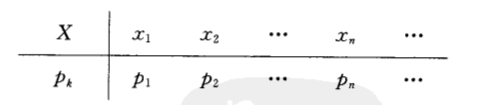
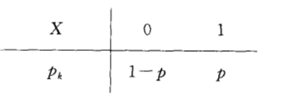

# 第二章 随机变量及其分布

## 2.1 随机变量的概念

### 定义

设随机试验的样本空间为 $S={e}$，则$X=X(e)$是定义在样本空间$S$上的实值单值函数，称==$X=X(e)$==为*随机变量*，称$\{e \mid X(e)=a\}$为*事件*

## 2.2 离散型随机变量及其分布律

### 定义

可能取到的值是*有限个*或*可列无限多个*的随机变量称为**离散型随机变量**

设离散型随机变量 $X$ 所有可能的取值为 $x_k(k=1,2,...)$，则事件 $\{X=x_k\}$ 的概率为 

$$
P\{X=x_k\}=p_k,k=1,2...
$$
由概率的定义，pk 满足如下两个条件

1. $p_{k} \geqslant 0, k=1,2, \cdots ;$
2. $\sum_{k=1}^{\infty} p_{k}=1$

分布律也可以用表格的方式来表示

 

### 常见的分布

#### （0 - 1）分布

即 $P\{X=k\}=p^k(1-p)^{1-k},k=0,1$

	

#### 伯努利试验、二项分布

设试验 E 只有两个可能结果：$A$ 及 $\overline A $ ，则称 E 为*伯努利试验*

设 $P(A)=p(0<p<1)$ ，此时 $P(\overline A)=1-p$ ，将 E 独立重复地进行 n 次，则称这一串重复独立式验为 **n 重伯努利试验**（重复是指每次试验的概率不变，独立是指各个试验的结果互不影响）

以 X 表示 n 重伯努利试验中事件 A 发生的次数，X 是一个随机变量，X 的取值为 0，1，2，…，n，则事件 A 在指定的 k（0 <= k <= n)次试验中发生，在其他 n - k 次试验中 A 不发生的概率为 $p^k(1-p)^{n-k}$，故在 n 次试验中 A 发生 k 次的概率为 $\left(\begin{array}{l}n \\ k\end{array}\right) p^{k}(1-p)^{n-k}$ ，记 $q=1-p$，即有
$$
P\{X=k\}=\left(\begin{array}{l}n \\ k\end{array}\right) p^{k}q^{n-k}
$$
因为 $\left(\begin{array}{l}n \\ k\end{array}\right) p^{k}(1-p)^{n-k}$ 刚好是二项式 $(p+q)^n$ 的展开式中出现 pk 的那一项，我们称随机变量 X 服从参数为 n，p 的*二项分布*，并记为 $X~b(n,p)$ ，特别，当 n = 1 时，二项分布 (2) 化为 $p^{k}q^{n-k},k=0,1$，即（0 - 1）分布

## 2.3 连续型随机变量及其概率密度函数

### 定义

非负可积函数 f(x)，$f(x)\ge 0,a<b$，则
$$
p\{a<X \leq b\}=\int_{a}^{b} f(x) d x
$$

X 为连续型随机变量，f(X) 为概率分布密度函数，记作$X~f(x)$

### 性质

1. $f(x)\ge 0$

2. $\int_a^b f(x)=1$

3. 连续型随机变量，取*个别值的概率*为 0

4. 连续型随机变量左右端点取不取得到无所谓，即
   $$
   P\{a\le x\le b\}=P\{a< x\le b\}=P\{a\le x< b\}=P\{a< x< b\}\\
   P\{x<a\}=P\{x\le a\}\\
   P\{x>a\}=P\{x\ge a\}
   $$
   
5. 概率为 0 的事件未必是不可能事件，概率为 1 的事件未必是必然事件

6. $f\{x<x<x+\Delta x\} \approx f(x) \Delta x$ 

### 例题

$f(x)=\left\{\begin{array}{cc}
k x + 1 & 0 \leqslant x \leqslant 2 \\
0 . & 其他
\end{array}\right.$，求 $k$ , $P\{X\le2\}$ 和 $P\{1.5<X<2.5\}$

解：$\int_{-\infty}^{+\infty} f(x) d x=\int_{0}^{2}(k x+1) d x=1,则k=-\frac{1}{2}$

​       $P\{X\le2\}=P\{-\infty<X\le2\}=\int_{-\infty}^2f(x)dx=\int^2_0(-\frac{1}{2}x+1)dx=1$

​       $P\{1.5<X<2.5\}=\int^2_{1.5}(-\frac{1}{2}x+1)dx=0.0625$

## 2.4 随机变量的分布函数

### 定义

分布函数：
$
F(x)=P(X\le x)
$
即 X 取值不超过 x 时的概率

分布函数是个普通的实函数，$x \in(-\infty,+\infty) \quad F(x) \in[0,1]$

对离散型和连续型随机变量都成立

### 性质

1. $0\le F(x)\le 1,x \in(-\infty,+\infty)$ 
2. F(x) 是个不减函数，任给$x_1<x_2$，有$F(x_1)\le F(x_2)$，因为$P(x_1)\le P(x_2)$（$P(x_1)包含于P(x_2))$
3. $\lim _{x \rightarrow+\infty} F(x)=F(+\infty)=1$；$\lim _{x \rightarrow-\infty} F(x)=F(-\infty)=0$
4. F(x) 是右连续的（*离散型*的是右连续的，*连续型*的是连续的）

### 常见的算式

$$
\begin{array}{l}
F(x)=P(x \leq x) \\
P\{x \leq a\}=F(a) \\
P\{x>a\}=1-P\{x \leq a\}=1-F(a) \\
P\{a<x \leq b\}=p\{x \leqslant b\}-p\{x \leqslant a\}=F(b)-F(a) \\
P\{x=a\}=F(a)-F(a-0) \\
P\{a \leqslant x \leqslant b\}=F(b)-F(a-0) \\
P\{x<a\}=F(a-0) 此时的x是从左边逼近a，但是不包含F(a)\\
P\{x>\alpha\}=1-F(a-0)
\end{array}
$$

